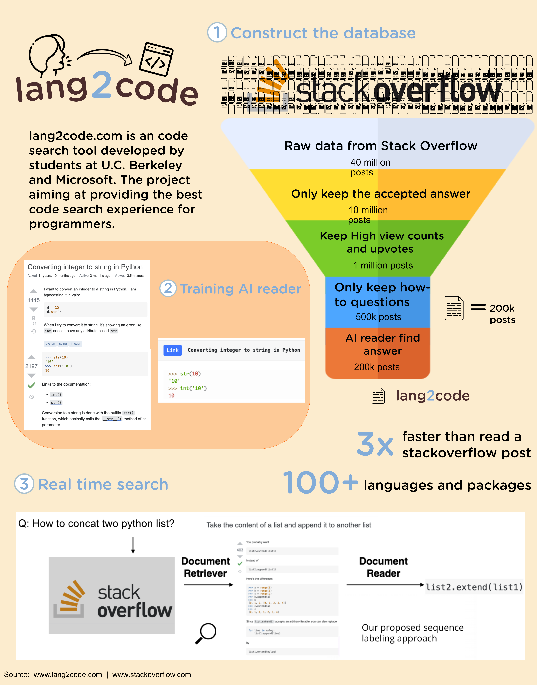

## Lang2code

Hi!
Here is the [lang2code](https://www.lang2code.com) website, check it out!

Hello All! Here is a demonstration of what a basic webpage would look like after embedding the visualization using the tools we learned so far: Vega-lite, Tableau, AD, and D3.  


<html>

<h2>Vega-Lite</h2>

<iframe width="100%" height="607" frameborder="0"
  src="https://observablehq.com/embed/@changran/vega-lite-assignment?cells=fig1"></iframe>
  
<h2>Tableau</h2>
In order to embed your Tableau dashboard to the sites, you will first have to publish your worksheet to <a href="https://public.tableau.com/en-us/s/">Tableau Public</a>. Once you publish, similar to above step, you will need to copy the embedded html code and paste it here. 

  <div class='tableauPlaceholder' id='viz1618378263510' style='position: relative'><noscript><a href='#'></a></noscript><object class='tableauViz'  style='display:none;'><param name='host_url' value='https%3A%2F%2Fpublic.tableau.com%2F' /> <param name='embed_code_version' value='3' /> <param name='site_root' value='' /><param name='name' value='Conspiracy_Score&#47;Dashboard1' /><param name='tabs' value='no' /><param name='toolbar' value='yes' /><param name='static_image' value='https:&#47;&#47;public.tableau.com&#47;static&#47;images&#47;Co&#47;Conspiracy_Score&#47;Dashboard1&#47;1.png' /> <param name='animate_transition' value='yes' /><param name='display_static_image' value='yes' /><param name='display_spinner' value='yes' /><param name='display_overlay' value='yes' /><param name='display_count' value='yes' /><param name='language' value='en' /></object></div>                <script type='text/javascript'>                    var divElement = document.getElementById('viz1618378263510');                    var vizElement = divElement.getElementsByTagName('object')[0];                    if ( divElement.offsetWidth > 800 ) { vizElement.style.width='1000px';vizElement.style.height='827px';} else if ( divElement.offsetWidth > 500 ) { vizElement.style.width='1000px';vizElement.style.height='827px';} else { vizElement.style.width='100%';vizElement.style.height='927px';}                     var scriptElement = document.createElement('script');                    scriptElement.src = 'https://public.tableau.com/javascripts/api/viz_v1.js';                    vizElement.parentNode.insertBefore(scriptElement, vizElement);                </script>

<h2>Images (Infographic in this case) </h2>
If you'd like to put simple images, you can upload the image file to your repository and use img html tag and put the source. 


<h2>D3</h2>
Same process as Vega-Lite using embedding from Observable notebook. 
<iframe width="100%" height="384" frameborder="0"
  src="https://observablehq.com/embed/@info247-spring21/lab-11-d3-tutorial-2-creating-an-arc-diagram-with-animated-tr/7?cells=vJustNodesAndLabels"></iframe>

<h2>Helpful Resources</h2>
  - <a href="https://guides.github.com/features/mastering-markdown/">Mastering Markdown</a>
  
  - <a href="https://observablehq.com/@observablehq/introduction-to-embedding">Observable's Intro to Embedding</a>
  
  - <a href="https://courses.ischool.berkeley.edu/i247/s20/">Last year's projects</a>

</html>

### Markdown

Markdown is a lightweight and easy-to-use syntax for styling your writing. It includes conventions for

```markdown
Syntax highlighted code block

# Header 1
## Header 2
### Header 3

- Bulleted
- List

1. Numbered
2. List

**Bold** and _Italic_ and `Code` text

[Link](url) and 
```

For more details see [GitHub Flavored Markdown](https://guides.github.com/features/mastering-markdown/).

### Jekyll Themes

Your Pages site will use the layout and styles from the Jekyll theme you have selected in your [repository settings](https://github.com/KevinHuuu/infovizlab12/settings/pages). The name of this theme is saved in the Jekyll `_config.yml` configuration file.

### Support or Contact

Having trouble with Pages? Check out our [documentation](https://docs.github.com/categories/github-pages-basics/) or [contact support](https://support.github.com/contact) and we’ll help you sort it out.
